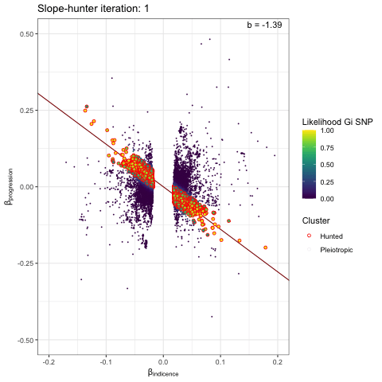
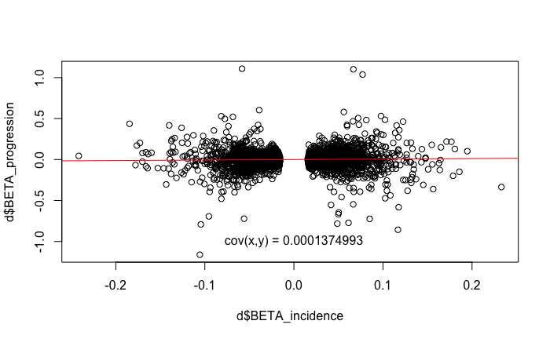
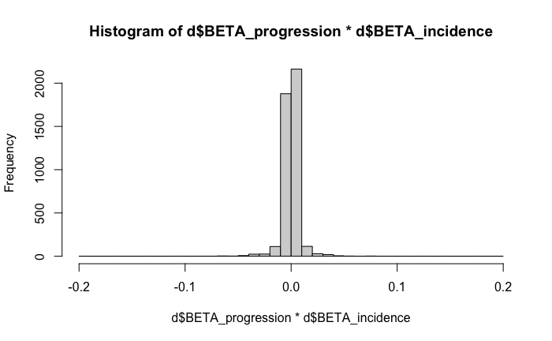
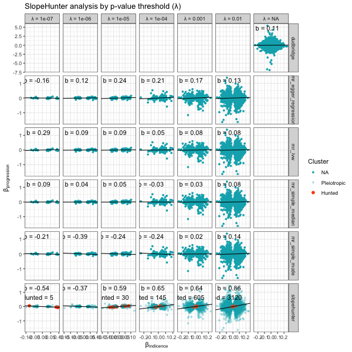
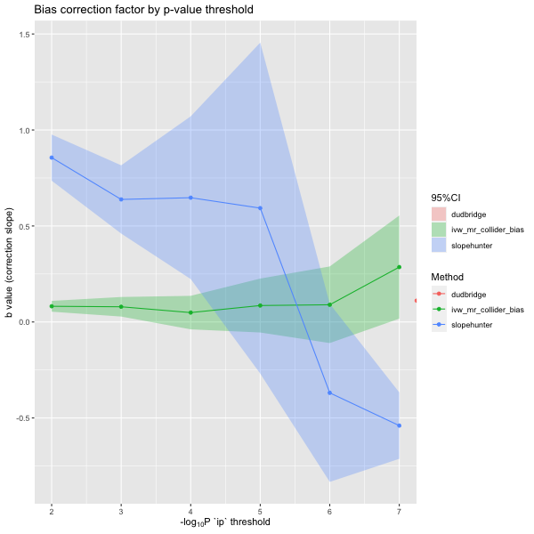
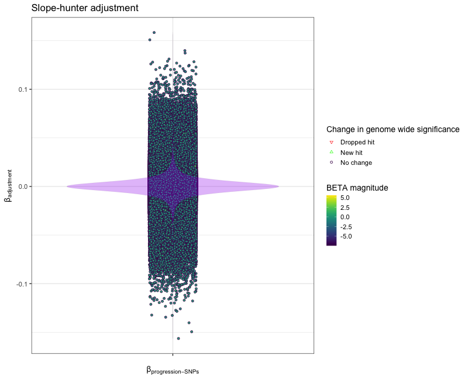

```{r, include = FALSE}
knitr::opts_chunk$set(
  collapse = TRUE,
  comment = "#>"
)
```

An example of using the collider bias functions to investigate the degree of index event (collider) bias in your GWAS progression data. We 
start with independent variants from the incident GWAS of interest - this will will require pre-processing with appropriate clumping 
parameters. All variants from the progression GWAS are included in the initial step. 

```{r hidden_paths, include=FALSE, eval=F}
clumped_incidence_path <- "/Users/xx20081/Documents/local_data/hermes_incidence/clumped/hf_incidence_pheno1_eur.clumps.gz"
progression_path       <- "/Users/xx20081/Documents/local_data/results/progression_meta_analysis/all/meta.all.allcause_death.autosomes.gz"
```

```{r setup, eval=F}
library(genepi.utils)

# read in the data
gwas_clumped_incidence <- data.table::fread(clumped_incidence_path)[index==TRUE, ] # take only the index SNPs 
gwas_progression       <- data.table::fread(progression_path)
```

## Slope-hunter

### Background

Run the SlopeHunter expectation-maximization method to estimate the bias adjustment factor. The algorithm uses model-based clustering and 
proposes that the distributions of the incidence(GI) and progression (GP) BETAs can be written like so:  

$$
  \binom{\beta_{GI}}{\beta'_{GP}}
  \sim
  \color{#F8766D}{
  \pi_{1}N
  \begin{pmatrix}
  \underline{0},
  \begin{bmatrix}
  \sigma_{I}^{2} & b_{1}\sigma_{I}^{2} \\
  b_1\sigma_{I}^{2} & b_{1}^{2}\sigma_{I}^{2} \\
  \end{bmatrix}
  \end{pmatrix}}
  +
  \color{#619CFF}{
  \pi_{2}N
  \begin{pmatrix}
  \underline{0},
  \begin{bmatrix}
  \sigma_{I}^{2} & b_{1}\sigma_{I}^{2} + \sigma_{IP} \\
  b_1\sigma_{I}^{2} + \sigma_{IP} & b_{1}^{2}\sigma_{I}^{2} + \sigma_{P}^{2} + 2b_{1}\sigma_{IP} \\
  \end{bmatrix}
  \end{pmatrix}}
  \color{gray}{
  +
  \pi_{3}
  \begin{pmatrix}
  \eta_{0} \\
  N(0, \sigma_{P}^{2})
  \end{pmatrix}
  +
  \pi_{4}
  \begin{pmatrix}
  \eta_{0} \\
  \eta_{0}
  \end{pmatrix}}
$$
  
  
* Cluster 1: SNPs that cause incidence but not progression (red)  
* Cluster 2: SNPs that cause incidence and progression (blue)  
* Cluster 3: SNPs that cause progression but not incidence (gray)  
* Cluster 4: SNPs that cause neither incidence or progression (gray)    

The values: $${\pi_{1}, \pi_{2}, \pi_{3}, \pi_{4}}$$ ... are the probabilities that a SNP belongs to the respective clusters.  

The first thing to note is that we can filter out SNPs from cluster 3 and 4 by only including SNPs with a significant association (P-value) with incidence - this is the `ip` parameter. The problem is then reduced to finding two clusters that best fit distributions 1 and 2 of the equation above. The SlopeHunter EM algorithm iteratively determines which SNPs belong to each distribution and once complete the adjustment factor (slope gradient) can be determined from group 1, i.e. only those SNPs thought to solely cause incidence.  

This function's code is adapted from the SlopeHunter R package and if using this method the SlopeHunter package should be referenced as the original source.


### Run

Running the Slope-hunter algorithm requires initialising parameters.  

* `ip` is the initial p-value by which to filter the incident GWA variants. Variants with a p-value greater that `ip` will be removed from the analysis (i.e. variants in clusters 3 & 4).
* `pi0` is an initial guess for the proportion of variants that only associate with incidence (i.e. belong to cluster 1).  
* `sxy1` is an initial guess for the covariance between incidence and progression betas in cluster 2.  

The standard error of the slope is estimated with bootstrapping, 100 samples in the case below.

```{r run_slopehunter, eval=FALSE}
result <- slopehunter(gwas_i     = gwas_clumped_incidence,
                      gwas_p     = gwas_progression,
                      merge      = c("CHR"="CHR", "BP"="BP"), 
                      ip         = 0.001,
                      pi0        = 0.6,
                      sxy1       = 1e-5,
                      bootstraps = 0)

str(result)
```


### Visualise

We can visualise the iterative EM algorithm like so. The variants are allocated to either cluster 1 (incidence only) or cluster 2 (incidence and progression) based on how well they conform to defined bivariate distributions for each cluster. The key point is that the incidence-only distribution has a linear relationship between incidence and progression betas, with no constant term - i.e. we search for a straight line passing through the origin. At each iteration the distribution parameters are recalculated (variance / s.dev / cov) and variant reassigned to either cluster 1 or 2, until the model converges.

```{r plot_gif, eval=FALSE}
p <- plot_slopehunter_iters(gwas_i = gwas_clumped_incidence,
                            gwas_p = gwas_progression,
                            ip     = 0.001,
                            pi0    = 0.6,
                            sxy1   = 1e-5,
                            x_lims = c(-0.2, 0.2), 
                            y_lims = c(-0.5, 0.5))

p
```
```{r save_gif, include=FALSE, eval=FALSE}
gganimate::anim_save("figures/slopehunter.gif")
```
```{r show_gif, echo=FALSE, out.width="90%", fig.align='center', eval=TRUE}

```

## The b-slope
In the expectation (E) part of the Slope-hunter algorithm we initially set the covariance matrix of the first component:
$$
\color{#F8766D}{
  \pi_{1}N
  \begin{pmatrix}
  \underline{0},
  \begin{bmatrix}
  \sigma_{I}^{2} & b_{1}\sigma_{I}^{2} \\
  b_1\sigma_{I}^{2} & b_{1}^{2}\sigma_{I}^{2} \\
  \end{bmatrix}
  \end{pmatrix}}
$$
The off-diagonal components are set to `sxy0 = sx0*sy0*dir0*0.95` where `sx0` and `sy0` are the standard deviations of the incidence and progression betas, respectively, and the `dir0` term is the `sign()` of the covariance - which is positive in this case:

```{r show_cov, echo=FALSE, out.width="90%", fig.align='center', eval=TRUE, fig.cap="Cov(incidence, progression)"}

```

In the maximisation (M) step of the algorithm, we update `dir0` as the `sign()` of `sum(pt*xbeta*ybeta)/sum(pt)`. `pt` is a positive array and so the sign depends on the relative proportions of negatives and positive of the product of `xbeta` and `ybeta`. This is positive in our case, as visualised in this histogram: 

```{r show_product, echo=FALSE, out.width="90%", fig.align='center', eval=TRUE, fig.cap="product(incidence, progression)"}

```

The effect, I believe, is that a positive slope is maintained at each iteration of the algorithm.


## Overall assessment - multiple methods

The algorithms can be sensitive to the incidence p-value threshold `ip`. Too high and null variants without any effect on incidence will be included. Too low and variants will small, but potentially significant, effects on incidence will be removed. It is a good idea to investigate the stability of the adjustment factor estimate to difference in `ip` threshold.

We can run many combinations of the above analyses by defining sets/vectors of parameters. Note: be careful with large numbers of parameters as this will quickly lead to large numbers of combinations. e.g.  

* methods = c("slopehunter")  
* ip = c(0.05,0.001,0.00001)  
* pi0 = c(0.6, 0.65, 0.7). 
* sxy1 = c(1e-5, 1e-4, 1e-3)  

...will lead to 27 separate analyses.  

We can use the `analyse_collider_bias()` function to run all combinations of methods and parameters. Here is the stability of the b-slope with different p-values (`ip`).

```{r plot_pvals, eval=FALSE}
results <- analyse_collider_bias(gwas_i = gwas_clumped_incidence,
                                 gwas_p = gwas_progression,
                                 merge  = c("CHR"="CHR", "BP"="BP"),
                                 methods= c("slopehunter","mr_collider_bias","dudbridge"),
                                 tsmr_method = c("mr_ivw","mr_egger_regression","mr_simple_median","mr_simple_mode"),
                                 ip     = c(0.01,0.001,0.0001,0.00001,0.000001,0.0000001),
                                 pi0    = c(0.6),
                                 sxy1   = c(1e-05),
                                 bootstraps = 100)

p <- plot_slope(results)
p
```
```{r save_pvals, include=FALSE, eval=FALSE}
png("figures/collider_slopes.png", width=600, height=600, units="px")
p
dev.off()
```
```{r show_pvals, echo=FALSE, out.width="98%", fig.align='center'}

```

Plotted another way with `plot_correction_stability()`.

```{r stability, eval=F}
p <- plot_correction_stability(results)
p
```
```{r save_all_pvals, include=FALSE, eval=FALSE}
png("figures/collider_stability.png", width=600, height=600, units="px")
p
dev.off()
```
```{r show_all_pvals, echo=FALSE, out.width="98%", fig.align='center'}

```


## Applying the correction factor

Once the parameters have been set and `b` estimate of the correction calculated we next need to apply the correction to the (biased) progression GWAS data. As the correction uses the incidence data we can only apply this to variants that appear in both incidence and progression datasets (the harmonised dataset).

$$
\beta_{GP} = \beta_{GP}^{'} - b_{1}\beta_{GI}
$$
```{r get_incidence, include=F, eval=F}
# read in the incidence GWAS - hidden from HTML output
gwas_incidence <- data.table::fread("/Users/xx20081/Documents/local_data/hermes_incidence/standardised/hf_incidence_pheno1_eur.tsv.gz")
```

```{r apply_correction, eval=F}
# apply correction
corrected_gwas <- apply_collider_correction(gwas_i = gwas_incidence, 
                                            gwas_p = gwas_progression,
                                            merge  = c("CHR"="CHR", "BP"="BP"),
                                            b_correction_factor = 0.6473,
                                            b_std_err = 0.2162)

# calculate difference in raw and adjusted betas; and effect on genome wide significance
corrected_gwas[, beta_diff := BETA_progression - adjusted_beta]
sig_change_levels <- c("Dropped hit", "New hit", "No change")
corrected_gwas[, sig_change:= data.table::fcase(P_progression < 5e-8 & adjusted_p >= 5e-8, factor("Dropped hit", levels=sig_change_levels),
                                                P_progression >=5e-8 & adjusted_p <  5e-8, factor("New hit", levels=sig_change_levels),
                                                default = factor("No change", levels=sig_change_levels))]

# plot difference
p <- ggplot2::ggplot(data    = corrected_gwas,
                     mapping = ggplot2::aes(x=factor(""), y = beta_diff)) +
  ggplot2::geom_point(mapping = ggplot2::aes(shape = sig_change, 
                                             fill  = adjusted_beta, 
                                             color = sig_change), alpha=0.95, position = ggplot2::position_jitter(seed = 1, width = 0.1)) +
  viridis::scale_fill_viridis() +
  ggplot2::scale_shape_manual(name = "Change in genome wide significance", 
                              values = c("Dropped hit"=25, "New hit"=24, "No change"=21), drop = FALSE) +
  ggplot2::scale_color_manual(name = "Change in genome wide significance",
                              values = c("Dropped hit"="red", "New hit"="green", "No change"="#44015410"), drop = FALSE) +
  ggplot2::geom_violin(alpha = 0.3, fill="purple", color="#44015410") +
  ggplot2::theme_bw(base_size = 14) +
  ggplot2::labs(title = 'Slope-hunter adjustment',
                x = expression("\u03B2"[progression-SNPs]),
                y = expression("\u03B2"[adjustment]), 
                color = "Change in genome wide significance", 
                fill = "BETA magnitude")
```

```{r save_adj, include=FALSE, eval=FALSE}
png("figures/collider_adjustment.png", width=800, height=650, units="px")
p
dev.off()
```
```{r show_adj, echo=FALSE, out.width="98%", fig.align='center'}

```
