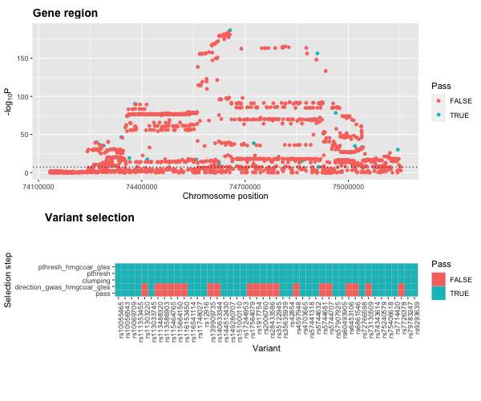

```{r, include = FALSE}
knitr::opts_chunk$set(
  collapse = TRUE,
  comment = "#>"
)
```

## Statins - a simple example

```{r setup}
library(genepi.utils)
library(ieugwasr)

# HMG-CoA reductase gene plus flanking area
hmgcoar_chr <- 5
hmgcoar_start <- 74632154
hmgcoar_end <- 74657929
flanking <- 5e5
clumping_window <- 2.5e5

# IEU LDL GWAS id
ldl_gwas_id <- "ieu-b-110"

# LDL variants
gwas_ldl_hmgcoar <- associations(variants = paste0(hmgcoar_chr,":",hmgcoar_start-flanking-clumping_window,"-",hmgcoar_end+flanking+clumping_window), id=ldl_gwas_id)

# standardise
gwas_ldl_hmgcoar <- standardise_gwas(gwas_ldl_hmgcoar, "ieugwasr", drop=TRUE, build="GRCh37")
```

```{r create_instrument, warning=FALSE, message=FALSE}
# extract the variants for the instrument
statin_instrument <- drug_target_proxy(gwas_ldl_hmgcoar, 
                                       gene_chr = "5",
                                       gene_start = 74632154,
                                       gene_end = 74657929,
                                       gene_flanks = 5e5,
                                       build = "GRCh37",
                                       clump = TRUE, 
                                       clump_ref = which_1000G_reference("GRCh37"),
                                       p1 = 5e-8, 
                                       r2 = 0.2, 
                                       kb = 250)

# take only those that pass the tresholding
statin_instrument <- statin_instrument[pass==TRUE, ]
```

```{r mi_gwas, warning=FALSE, message=FALSE}
library(TwoSampleMR)

# get myocardial infarction instruments
mi_instruments <- associations(variants = statin_instrument$RSID, id = "ukb-d-I9_MI")

# format statin instrument for TwoSampleMR
statin_instrument[, phenotype := "LDL (HMG-CoA-R / statin proxy)"]
hmgcoar_2SMR <- TwoSampleMR::format_data(statin_instrument |> as.data.frame(), 
                                         type = "exposure",
                                         phenotype_col = "phenotype",
                                         snp_col = "RSID",
                                         beta_col = "BETA",
                                         se_col = "SE",
                                         eaf_col = "EAF",
                                         effect_allele_col = "EA",
                                         other_allele_col = "OA",
                                         pval_col = "P",
                                         id_col = "phenotype")

# format MI instrument for TwoSampleMR
mi_2SMR <- TwoSampleMR::format_data(mi_instruments, 
                                    type = "outcome",
                                    phenotype_col = "trait",
                                    snp_col = "target_snp",
                                    beta_col = "beta",
                                    se_col = "se",
                                    eaf_col = "eaf",
                                    effect_allele_col = "ea",
                                    other_allele_col = "nea",
                                    pval_col = "p",
                                    id_col = "id")
  
# harmonise
dat <- TwoSampleMR::harmonise_data(hmgcoar_2SMR, mi_2SMR)

# run MR
res <- mr(dat)

# plot 
plot <- mr_scatter_plot(res, dat)

# view result
res
```

```{r save_plot, include=FALSE, eval=FALSE}
png("figures/hmgcoar_mr_plot.png", width=600, height=600, units="px")
plot
dev.off()
```

```{r view_plot, echo=FALSE, out.width="100%", fig.align='center'}

```


## Statins - an eQTL example

```{r create_instrument2, warning=FALSE, message=FALSE}
# extract eQTL data for the variants
hmgcar_eqtl <- QTL("/Users/xx20081/Documents/local_data/gtex_v8/gtex_v8_chr5.tsv.gz", p_val=1, join_key="RSID_b37")

# set the concordance for beta effects in LDL and HMGCoAR
concordance <- data.table::data.table("data_name_1" = c(""), data_name_2=c("hmgcoar_gtex"), concordant=c(TRUE))

# extract the variants for the instrument
statin_instrument_dat <- drug_target_proxy(gwas_ldl_hmgcoar, 
                                       gene_chr = "5",
                                       gene_start = 74632154,
                                       gene_end = 74657929,
                                       gene_flanks = 5e5,
                                       build = "GRCh37",
                                       clump = TRUE, 
                                       clump_ref = which_1000G_reference("GRCh37"),
                                       p1 = 5e-8, 
                                       r2 = 0.2, 
                                       kb = 250, 
                                       QTL_list = list("hmgcoar_gtex"=hmgcar_eqtl), 
                                       concordance = concordance)

# plot
plot3 <- plot_drug_proxy_instrument(statin_instrument_dat, remove=c("gwas_pthresh", "clumping"))
```

```{r save_plot3, include=FALSE, eval=FALSE}
png("figures/hmgcoar_instrument_plot.png", width=600, height=500, units="px")
plot3
dev.off()
```

```{r view_plot3, echo=FALSE, out.width="100%", fig.align='center'}

```

```{r mi_gwas2, warning=FALSE, message=FALSE}
# take only those that pass the tresholding
statin_instrument2 <- statin_instrument_dat[pass==TRUE, ]

# format new statin instrument for TwoSampleMR
statin_instrument2[, phenotype := "LDL (HMG-CoA-R with Gtex / statin proxy)"]
hmgcoar2_2SMR <- TwoSampleMR::format_data(statin_instrument2 |> as.data.frame(), 
                                         type = "exposure",
                                         phenotype_col = "phenotype",
                                         snp_col = "RSID",
                                         beta_col = "BETA",
                                         se_col = "SE",
                                         eaf_col = "EAF",
                                         effect_allele_col = "EA",
                                         other_allele_col = "OA",
                                         pval_col = "P",
                                         id_col = "phenotype")

  
# harmonise
dat2 <- TwoSampleMR::harmonise_data(hmgcoar2_2SMR, mi_2SMR)

# run MR
res2 <- mr(dat2)

# plot 
plot2 <- mr_scatter_plot(res2, dat2)

# view result
res2
```

```{r save_plot2, include=FALSE, eval=FALSE}
png("figures/hmgcoar_gtex_mr_plot.png", width=600, height=600, units="px")
plot2
dev.off()
```

```{r view_plot2, echo=FALSE, out.width="100%", fig.align='center'}

```


