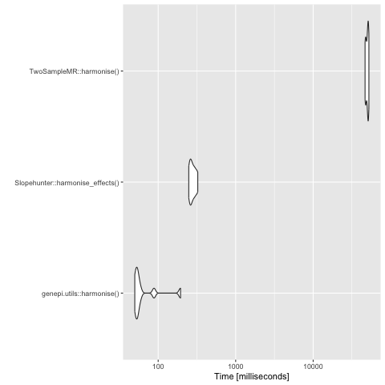

```{r, include = FALSE}
knitr::opts_chunk$set(
  collapse = TRUE,
  comment = "#>"
)
```

## Run

Harmonise two datasets. Ensure that both GWAS inputs are standardised with `standardise_gwas()` and that the appropriate columns to join on
are specified in the `merge` argument - usually either `c("CHR"="CHR","BP"="BP")` or `c("RSID"="RSID")`.

```{r setup}
library(genepi.utils)

# the gwas data
gwas1 <- GWAS(dat=system.file("extdata", "example2_gwas_sumstats.tsv", package="genepi.utils"), map="ns_map")
gwas2 <- GWAS(dat=system.file("extdata", "example2_gwas_sumstats.tsv", package="genepi.utils"), map="ns_map")
gwas1 <- as.data.table(gwas1)
gwas2 <- as.data.table(gwas2)

# mess with some alleles
gwas1[c(5,7,8), c("ea","oa") := list(c("T","I","I"),c("A","D","D"))]
gwas2[c(5,6,7,8), c("ea","oa") := list(c("A","A","D","ACC"),c("T","A","I","A"))]

# view
gwas2

# harmonise
harmonised <- harmonise(gwas1, gwas2, merge=c("chr"="chr","bp"="bp"))[]

# view 
harmonised
```

## Evaluation speed

The number of variants for evaluation speed analysis was downsampled to 100,000, as otherwise it takes a very long time. 

```{r speed, echo=FALSE, out.width="80%", fig.align='center', fig.cap="Analysis with downsampled GWAS of 100,000 variants"}

```

```{r benchmarck, eval=FALSE}
library(microbenchmark)
library(ggplot2)

gwas_progression_path <- "/Users/xx20081/Documents/local_data/hermes_progression/biostat_disc/post_qc/biostat_disc.allcause_death.autosomes.gz"
gwas_incidence_path   <- "/Users/xx20081/Documents/local_data/hermes_incidence/standardised/hf_incidence_pheno1_eur.tsv.gz"

# some GWAS data
gwas1 <- data.table::fread(gwas_incidence_path)[1:100000, ]
gwas2 <- gwas1

# Slopehunter read in 
gwas1_sh <- SlopeHunter::read_incidence(gwas_incidence_path, snp_col="SNP", beta_col="BETA", se_col="SE", pval_col="P", eaf_col="EAF", effect_allele_col="EA", other_allele_col="OA", chr_col = "CHR", pos_col="POS")[1:100000, ]
gwas2_sh <- SlopeHunter::read_prognosis(gwas_incidence_path, snp_col="SNP", beta_col="BETA", se_col="SE", pval_col="P", eaf_col="EAF", effect_allele_col="EA", other_allele_col="OA", chr_col = "CHR", pos_col="POS")[1:100000, ]

# TwoSampleMR read in 
gwas1_2smr <- TwoSampleMR::format_data(gwas1 |> as.data.frame(), type="exposure", snp_col="SNP", beta_col="BETA", se_col="SE", pval_col="P", eaf_col="EAF", effect_allele_col="EA", other_allele_col="OA", chr_col = "CHR", pos_col="POS")[1:100000, ]
gwas2_2smr <- TwoSampleMR::format_data(gwas1 |> as.data.frame(), type="outcome", snp_col="SNP", beta_col="BETA", se_col="SE", pval_col="P", eaf_col="EAF", effect_allele_col="EA", other_allele_col="OA", chr_col = "CHR", pos_col="POS")[1:100000, ]

# benchmarking harmonisation
mbm <- microbenchmark("genepi.utils::harmonise()" = { genepi.utils::harmonise(gwas1, gwas2, merge=c("CHR"="CHR","BP"="BP")) },
                      "Slopehunter::harmonise_effects()" = { SlopeHunter::harmonise_effects(gwas1, gwas2) },
                      "TwoSampleMR::harmonise()" = { TwoSampleMR::harmonise_data(gwas1_2smr, gwas2_2smr) },
                      times = 10L)

# 2SMR issue fixed in recent commit
# mbm <- microbenchmark("TwoSampleMR::harmonise() - updated" = { TwoSampleMR::harmonise_data(gwas1_2smr, gwas2_2smr) },
#                       times = 10L)

autoplot(mbm)

# save
png("figures/microbenchmark_harmonise.png")
print(autoplot(mbm))
dev.off()
```
