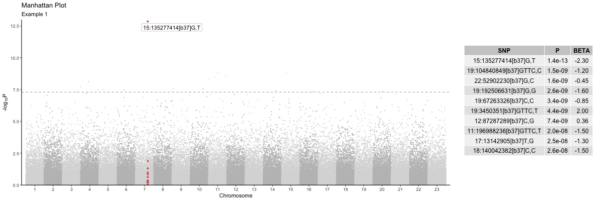
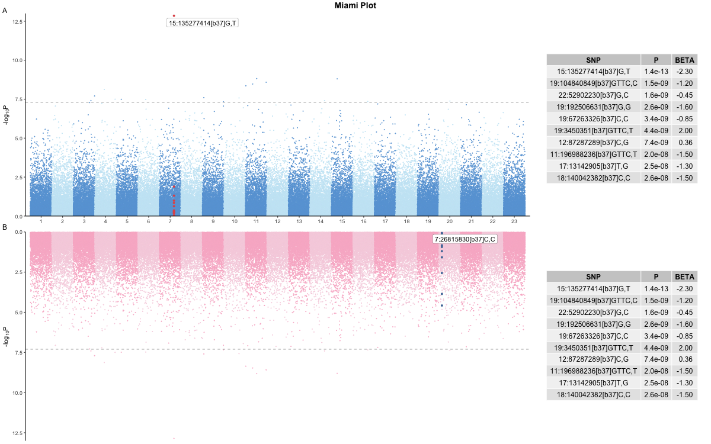

```{r, include = FALSE}
knitr::opts_chunk$set(
  collapse = TRUE,
  comment = "#>"
)
```

## Manhattan

Here is a simple example of using the `manhattan()` plot function. 

```{r setup_manhattan, eval=FALSE}
library(genepi.utils)

gwas <- generate_random_gwas_data(100000)

highlight_snps <- gwas[["SNP"]][[which.min(gwas[["P"]])]]

annotate_snps <- gwas[["SNP"]][[which.min(gwas[["P"]])]]

p <- manhattan(gwas,
               highlight_snps = highlight_snps,
               highlight_win = 250,
               annotate_snps = annotate_snps,
               hit_table = TRUE,
               title = "Manhattan Plot",
               subtitle = "Example 1")
```
```{r save_manhattan, eval=FALSE, include=FALSE}
png("figures/manhattan.png", width=1200, height=400, units="px")
p
dev.off()
```
```{r show_manhattan, echo=FALSE, out.width="98%"}

```

## Miami

Here is a simple example of using the `miami()` plot function. The use of named lists (i.e. 'top' and 'bottom') for the parameters is not strictly necessary, but helps readability. 

```{r setup_miami, eval=FALSE, message=FALSE, warning=FALSE}
library(genepi.utils)

gwas_top    <- generate_random_gwas_data(100000)
gwas_bottom <- generate_random_gwas_data(100000)

highlight_snps_top     <- gwas[["SNP"]][[which.min(gwas[["P"]])]]
highlight_snps_botttom <- gwas[["SNP"]][[which.max(gwas[["P"]])]]

annotate_snps_top      <- gwas[["SNP"]][[which.min(gwas[["P"]])]]
annotate_snps_botttom  <- gwas[["SNP"]][[which.max(gwas[["P"]])]]

colours_top    <- c("#67A3D9","#C8E7F5")
colours_bottom <- c("#F8B7CD","#F6D2E0")

p <- miami(gwases         = list("top"=gwas_top, "bottom"=gwas_bottom),
           highlight_snps = list("top"=highlight_snps_top, "bottom"=highlight_snps_botttom),
           highlight_win  = list("top"=250,"bottom"=250),
           annotate_snps  = list("top"=annotate_snps_top, "bottom"=annotate_snps_botttom),
           colours        = list("top"=colours_top, "bottom"=colours_bottom),
           downsample     = 0.0, 
           hit_table      = TRUE,
           title          = "Miami Plot",
           subtitle       = list("top"="A", "bottom"="B"))
```
```{r save_miami, include=FALSE, eval=FALSE}
png("figures/miami.png", width=1200, height=750, units="px")
p
dev.off()
```
```{r show_miami, echo=FALSE, out.width="98%"}

```


## EAF plot
```{r setup_eaf, eval=FALSE}
library(genepi.utils)

gwas <- generate_random_gwas_data(100000)
gwas[1:100, EUR_EAF := NA]

p <- eaf_plot(gwas,
              eaf_col = "EAF",
              ref_eaf_col = "EUR_EAF",
              tolerance = 0.2,
              colours = list(missing="#5B1A18", outlier="#FD6467", within="#7294D4"),
              title = "EAF study vs. reference plot")
```
```{r save_eaf, eval=FALSE, include=FALSE}
png("figures/eaf_plot.png", width=600, height=600, units="px")
p
dev.off()
```
```{r show_eaf, echo=FALSE, out.width="80%", fig.align='center'}

```
