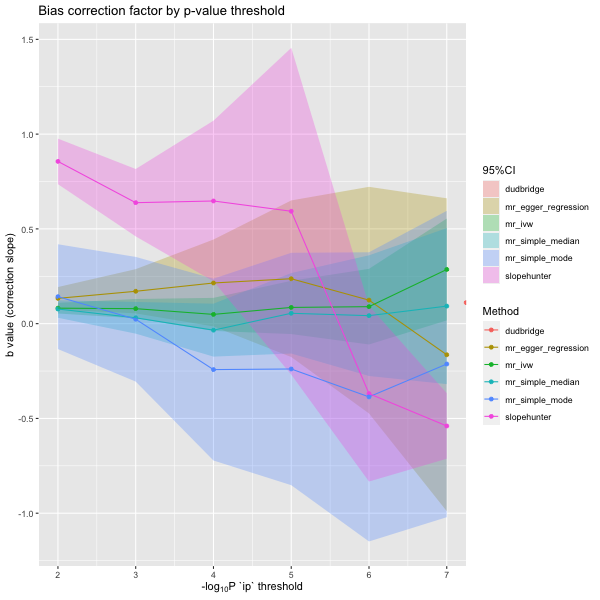

```{r, include = FALSE}
knitr::opts_chunk$set(
  collapse = TRUE,
  comment = "#>"
)
```

<style>
  body {
    text-align: justify
  }
</style>

The primary motivation for creating this package was to increase my understanding of the many tools used in the processing of GWAS data and Mendelian randomization analyses at the start of my PhD. Like many people new to the field, I found there to be an overwhelming number of options in many different languages, designed with slightly different use cases in mind.  


## Roadmap

**Phase 1** was aimed at simple GWAS processing:  
1. Reading files  
2. Field / column name standardiation  
3. Quality control and cleaning  
<br>

**Phase 2** was aimed at common GWAS routines:  
4. Clumping  
5. Annotating RSIDs  
6. Generating LD matrices  
7. Finding proxies variants  
<br>

**Phase 3** was aimed at more specific routines:  
8. Calling UVMR & MVMR routines from `TwoSampleMR` and `Mendelian Randomization`  
9. Index-event bias - calling `IndexEvent` and MR routines    
<br>


## Choice of language
The most commonly used languages for data analysis are `R` and `Python`, with many command line porgrammes written in `C++` and `C`. For ease of use, familiarity, and prospect of onoing collaboration I wrote this in `R`.
<br>

```{r, echo=FALSE, out.width="50%", fig.align='center'}

```


## Representation of GWAS data
The next question I had was how to represent GWAS in `R`. The obvious choice is a simple vectors or data.frames, but the range of structures used across common genetic epidemiology packages is wide, ranging from lists (that can take any data type and often require separate validation functions - e.g. `coloc`) to layers of custom classes that can be difficult to understand and re-use.
<br>

```{r, echo=FALSE, out.width="80%", fig.align='center'}

```
<br>


## GWAS data specification
The GWAS data we need for the majority of analyses is well defined but the range of data formats out in the wild is all too often lacking. Data standardisation continues to be addressed and there exists many good resources and recommended specifications.
<br>

```{r, echo=FALSE, out.width="60%", fig.align='center'}


```
<br>

```{r, echo=FALSE, out.width="100%", fig.align='center'}

```
<br>


### Data type considerations
There may be some data type considerations in terms of memory, especially when dealing with very large GWAS datasets on more standard machines. With off-the-self computer memory increasesing this is becoming less of an issue. 
<br>

```{r, echo=FALSE, out.width="80%", fig.align='center'}
knitr::include_graphics("figures/gwas_types_memory.png")
```
<br>


## S7
I really wanted an object-orientated approach and after initial frustrations with the `S4` and `R6` class systems I was made aware of the new `S7` class system. Being probably too quick to jump on the latest trend I refactored my initial code into `S7`. I liked the `S7` class system as it has strongly typed properties and simplifies what can be quite complex idiosyncrasies in `S4`. It also has a really nice constructor and validation process built in.

### Simple S7 class
```{r s7_simple}
library(S7)

# define a new class
CodeClinicSession <- new_class(
  name       = "CodeClinicSession",
  properties = list(
    presenter = class_character,
    date      = class_Date
  )
)

# create a CodeClinicSession object
session <- CodeClinicSession("nick", as.Date("2024-07-25"))

session

# define a generic print function 
method(print, CodeClinicSession) <- function(x) {
  cat("CodeClinicSession\n")
  cat("\tPresenter:", x@presenter, "\n")
  cat("\tDate:", format(x@date, "%d-%m-%Y"), "\n")
}

print(session)
```

### S7 property validation
```{r s7_complex}
# define a more complicated class
CodeClinicSession <- new_class(
  name       = "CodeClinicSession",
  properties = list(
    presenter = new_property(class     = class_character, 
                             validator = function(value) { 
                               valid_presenters <- c("nick sunderland", "foo", "bar")
                               if (!value %in% valid_presenters) {
                                 found <- grep(value, valid_presenters, value = TRUE)
                                 if (length(found) > 0) {
                                   return(paste(value, "- did you mean presenter", found, "?"))
                                 } else {
                                   return(value)
                                 }
                               } 
                             }),
    date      = new_property(class   = class_Date, 
                             default = Sys.Date())
  )
)

# create a CodeClinicSession object
try(CodeClinicSession("nick"))

try(CodeClinicSession("nick sunderland"))
```

### S7 constructor
```{r s7_constructor}
# define a more complicated class
CodeClinicSession <- new_class(
  name       = "CodeClinicSession",
  properties = list(
    presenter = class_character,
    date      = class_Date
  ), 
  constructor = function(some_text) {
    # parse some text
    valid_presenters <- c("nick sunderland", "foo", "bar")
    presenter <- valid_presenters[sapply(valid_presenters, grepl, some_text, ignore.case = TRUE)]
    date      <- as.Date(sub(".*?([0-9]+-[0-9]+-[0-9]+).*", "\\1", some_text))
    
    # load the properties
    object <- new_object(S7::S7_object(), 
                         presenter = presenter, 
                         date      = date)
    
    # return the object
    return(object)
  }
)

# create a CodeClinicSession object
session <- CodeClinicSession("Nick Sunderland presenting on 2024-07-25")

session
```

### GWAS class
Putting this all together I created a GWAS class. 

```{r s7_gwas, eval = FALSE}
GWAS <- new_class(
  #==============================
  # GWAS class name
  #==============================
  name    = "GWAS",
  package = "genepi.utils",

  #==============================
  # GWAS class properties
  #==============================
  properties = list(
    #----------------------------
    # column name mapping
    #----------------------------
    map     = ColumnMap,
    #----------------------------
    # qc procedures
    #----------------------------
    qc      = class_list,
    #----------------------------
    # column names / data vectors
    #----------------------------
    rsid    = class_character,
    chr     = class_character,
    bp      = class_integer,
    ea      = class_character,
    oa      = class_character,
    eaf     = class_numeric,
    beta    = class_numeric,
    se      = class_numeric,
    p       = class_numeric,
    n       = class_integer,
    ncase   = class_integer,
    strand  = class_character,
    imputed = class_logical,
    info    = class_numeric,
    q       = class_numeric,
    q_p     = class_numeric,
    i2      = class_numeric,
    #----------------------------
    # correlation matrix
    #----------------------------
    correlation = new_S3_class('matrix'),
    #----------------------------
    # meta data
    #----------------------------
    trait   = class_character,
    id      = class_character,
    source  = class_character
  ),

  #==============================
  # GWAS class constructor func.
  #==============================
  constructor = function(dat,
                         map            = "default",
                         drop           = FALSE,
                         fill           = FALSE,
                         fill_rsid      = FALSE,
                         missing_rsid   = "fill_CHR:BP",
                         parallel_cores = parallel::detectCores(),
                         dbsnp_dir      = genepi.utils::which_dbsnp_directory(),
                         filters = list(
                           beta_invalid    = "!is.infinite(beta) & abs(beta) < 20",
                           eaf_invalid     = "eaf > 0 & eaf < 1",
                           p_invalid       = "!is.infinite(p)",
                           se_invalid      = "!is.infinite(se)",
                           alleles_invalid = "!is.na(ea) & !is.na(oa)",
                           chr_missing     = "!is.na(chr)",
                           bp_missing      = "!is.na(bp)",
                           beta_missing    = "!is.na(beta)",
                           se_missing      = "!is.na(se)",
                           p_missing       = "!is.na(p)",
                           eaf_missing     = "!is.na(eaf)"),
                         reference      = NULL,
                         ref_map        = NULL,
                         verbose        = TRUE,
                         ...) {

    if(verbose) message("Loading GWAS ...")

    # parse the map
    map <- ColumnMap(map)

    # as data table
    if(inherits(dat, 'data.frame') && !inherits(dat, 'data.table')) { dat <- data.table::as.data.table(dat) }

    # load (either from file or data.frame)
    gwas <- load_gwas(dat, map=map, drop=drop, fill=fill, verbose=verbose)

    # ensure correct type
    gwas <- type_columns(gwas, map=map, verbose=verbose)

    # standardise columns
    gwas <- standardise_columns(gwas, verbose=verbose)

    # standardise alleles
    gwas <- standardise_alleles(gwas, verbose=verbose)

    # apply filters
    g    <- apply_filters(gwas, filters=filters, verbose=verbose)
    gwas <- g$gwas
    qc   <- g$qc

    # add or reformat id/rsid
    gwas <- populate_rsid(gwas, fill_rsid=fill_rsid, missing_rsid=missing_rsid, parallel_cores=parallel_cores, dbsnp_dir=dbsnp_dir, verbose=verbose)

    # harmonise to reference
    g <- harmonise_reference(gwas, reference=reference, ref_map=ref_map, qc=qc, verbose=verbose)
    gwas <- g$gwas
    qc   <- g$qc

    # other changes
    gwas[p==0, p := .Machine$double.xmin]

    # group together as a big list; add the other properties that may have been passed
    props <- c(gwas, list(map=map, ...))

    # don't need to save all of repetitive columns
    if(!"n"      %in% names(props))                                   { props$n       <- NA_integer_         }
    if(!"ncase"  %in% names(props))                                   { props$ncase   <- NA_integer_         }
    if(!"strand" %in% names(props))                                   { props$strand  <- NA_character_       }
    if(!"imputed"%in% names(props))                                   { props$imputed <- NA                  }
    if(!"info"   %in% names(props))                                   { props$info    <- NA_real_            }
    if(!"q"      %in% names(props))                                   { props$q       <- NA_real_            }
    if(!"q_p"    %in% names(props))                                   { props$q_p     <- NA_real_            }
    if(!"i2"     %in% names(props))                                   { props$i2      <- NA_real_            }
    if("n"       %in% names(props) && length(unique(props$n))==1    ) { props$n       <- unique(props$n)     }
    if("ncase"   %in% names(props) && length(unique(props$ncase))==1) { props$ncase   <- unique(props$ncase) }
    if("strand"  %in% names(props) && length(unique(props$strand))==1){ props$strand  <- unique(props$strand)}
    if(!"trait"  %in% names(props))                                   { props$trait   <- "trait"}
    if(!"id"     %in% names(props))                                   { props$id      <- "id" }
    if(length(unique(props$trait))==1)                                { props$trait   <- unique(props$trait) }
    if(length(unique(props$id))==1)                                   { props$id      <- unique(props$id)    }

    # set filters and qc
    props$qc <- qc

    # set correlation matrix if not provided
    if(!"correlation" %in% names(props)) { props$correlation <- matrix() }

    # set data source
    if(is.character(dat) && file.exists(dat)) {
      props$source <- dat
    } else {
      props$source <- 'data.table'
    }

    # assign to the class object
    object <- new_object(S7::S7_object(),
               map         = props$map,
               qc          = props$qc,
               rsid        = props$rsid,
               chr         = props$chr,
               bp          = props$bp,
               ea          = props$ea,
               oa          = props$oa,
               eaf         = props$eaf,
               beta        = props$beta,
               se          = props$se,
               p           = props$p,
               n           = props$n,
               ncase       = props$ncase,
               strand      = props$strand,
               imputed     = props$imputed,
               info        = props$info,
               q           = props$p,
               q_p         = props$q_p,
               i2          = props$i2,
               trait       = props$trait,
               id          = props$id,
               source      = props$source,
               correlation = props$correlation)

    # return the object
    return(object)
  },

  #==============================
  # GWAS class validator func.
  #==============================
  validator = function(self) {
    stopifnot("Unequal vector lengths" = sapply(lengths(list(self@rsid, self@chr, self@bp, self@ea, self@oa, self@eaf, self@beta, self@se, self@p)), function(x) x == length(self@rsid)))
    stopifnot("Invalid sample size `n`"       = length(self@n)<=1 || length(self@n)==length(self@rsid))
    stopifnot("Invalid sample size `ncase`"   = length(self@ncase)<=1 || length(self@ncase)==length(self@rsid))
    stopifnot("Invalid sample size `strand`"  = length(self@strand)<=1 || length(self@strand)==length(self@rsid))
    stopifnot("Invalid sample size `imputed`" = length(self@imputed)<=1 || length(self@imputed)==length(self@rsid))
    stopifnot("Invalid sample size `info`"    = length(self@info)<=1 || length(self@info)==length(self@rsid))
    stopifnot("Invalid `trait` field length"  = length(self@trait)<=1)
    stopifnot("Invalid `id` field length"     = length(self@id)<=1)
  }
)

```

## Load a GWAS
```{r load_gwas, eval = FALSE}
library(genepi.utils)

# the datafile 
filepath <- system.file("extdata", "example2_gwas_sumstats.tsv", package="genepi.utils")

# the column mapping 
columns <- c('MARKER', 'CHR', 'POS', 'BETA', 'SE', 'P', 'EAF', 'A1', 'A2') # will try to guess standard name mapping
map <- ColumnMap(columns)

# load
gwas <- GWAS(dat = filepath, map = map, fill_rsid = "b37_dbsnp156")

# view as table
as.data.table(gwas)[, 1:10]

```

## Run an analysis
```{r run_analysis, eval = F}
# bmi
bmi_gwas <- GWAS(dat = "/Users/xx20081/Documents/local_data/giant_2018/bmi.giant-ukbb.meta-analysis.combined.23May2018.gz", 
                 map = c(rsid = "SNP", chr = "CHR", bp = "POS", ea = "Tested_Allele", oa = "Other_Allele", eaf = "Freq_Tested_Allele", beta = "BETA", se = "SE", p = "P", n = "N"), 
                 trait = "bmi", 
                 id    = "bmi_gwas")

# heart failure
heart_failure_gwas <- GWAS(dat = "/Users/xx20081/Documents/local_data/hermes_incidence/raw/Pheno1_EUR/FORMAT-METAL_Pheno1_EUR.tsv.gz", 
                           map = c(rsid = "rsID", chr = "chr", bp = "pos_b37", ea = "A1", oa = "A2", beta = "A1_beta", eaf = "A1_freq", se = "se", p = "pval", ncase = "N_case", n = "N_total"), 
                           trait = "heart failure", 
                           id    = "hf_gwas")

# coronary artery disease
cad_gwas <- GWAS(dat = "/Users/xx20081/Documents/local_data/cad/GCST90043957_buildGRCh37.tsv.gz", 
                 map = c(rsid = "variant_id", chr = "chromosome", bp = "base_pair_location", ea = "effect_allele", oa = "other_allele", beta = "beta", eaf = "effect_allele_frequency", se = "standard_error", p = "p_value", n = "N"), 
                 trait = "coronary artery disease",
                 id    = "cad_gwas")

# create MR object (harmonises)
mr_object <- MR(exposure = list(bmi_gwas, cad_gwas),
                outcome  = heart_failure_gwas, 
                harmonise_strictness = 2)

# clumping
mr_object <- clump_mr(mr_object, p1 = 5e-8, r2 = 0.001, kb = 10000)
```

## MR object
```{r, echo=FALSE, out.width="100%", fig.align='center'}

```
<br>

```{r run_mr, eval = F}
# run mr
results <- run_mr(mr_object, methods = c('mr_ivw','mr_egger'))

# plot
plot_mr(mr_object, results)
```

```{r, echo=FALSE, out.width="100%", fig.align='center'}

```
<br>


```{r plot Manhattan, eval = F}
manhattan(cad_gwas)
```
```{r, echo=FALSE, out.width="100%", fig.align='center'}

```
<br>

```{r plot qqplot, eval = F}
qq_plot(cad_gwas)
```

```{r, echo=FALSE, out.width="100%", fig.align='center'}

```
<br>

## Other things

### Harmonisation
Having a highly reusable GWAS object means that it needs to persist all of the data, as it might subsequently be used for a different purpose requiring different data. Currently, that means harmonising many more variants which revealed a bottle-neck in TwoSampleMR::harmonise - now fixed.  

Evaluation speed analysis for harmonisation function. Tests run with 100,000 rows. 

```{r speed, echo=FALSE, out.width="80%", fig.align='center', fig.cap="Analysis with downsampled GWAS of 100,000 variants"}
knitr::include_graphics("figures/microbenchmark_harmonise.png")
```
<br>

```{r speed2, echo=FALSE, out.width="80%", fig.align='center', fig.cap="Post TwoSampleMR update"}

```


### RSID mapping
RSID annotation is a common problem. The issue is that dbSNP is huge, with more than 1 billion variants, so we need a good strategy. Options: 

* Formal database  
* Tabix  
* File splitting and parallelization  

I chose the third option. The principle is outlines below: 

#### Which subsetting files method?
`Fst` is the fastest at subsetting files. 
```{r subset_bench, out.width="50%", fig.align='center'}
if (FALSE) {
  tm <- microbenchmark("fst"        = { fst_dat[which(fst_dat["p"] < 5e-8), ]            },
                       "data.table" = { dat <- fread("gwas.tsv.gz"); dat[p < 5e-8, ]     },
                       "vroom"      = { dat <- vroom("gwas.tsv.gz"); dat[dat$p < 5e-8, ] },
                       times = 100)
}

```
<br>


#### genepi.utils::chrpos_to_rsid
```{r, echo=FALSE, out.width="100%", fig.align='center'}

```
<br>


#### RSID annotation for 10M rows
It's reasonably fast, for a 10 million row GWAS can process in ~ 4 minutes. 
```{r chrpos_bench, include=FALSE, eval=FALSE, out.width="100%", fig.align='center'}
dat <- data.table::fread("/Users/xx20081/Documents/local_data/hermes_incidence/raw/Pheno1_EUR/FORMAT-METAL_Pheno1_EUR.tsv.gz")
tm <- microbenchmark("chrpos_to_rsid" = { 
  genepi.utils::chrpos_to_rsid(dat,
                               chr_col = "chr",
                               pos_col = "pos_b37",
                               ea_col  = "A1",
                               nea_col = "A2",
                               build   = "b37_dbsnp156")    
  }, times = 10)
autoplot(tm)
```
<br>
```{r speed3, echo=FALSE, out.width="80%", fig.align='center', fig.cap="Post TwoSampleMR update"}

```


### Index event bias
There are multiple methods to investigate index-event bias. All take an incidence and progression GWAS plus some initiation parameters. This function calls grid.expand on the provided parameters and runs all permeations. The underlying functions are simply those in other packages as well as functions to run the clumping. 

```{r plot_pvals, eval=FALSE}
# n.b. function deprecated; now use `collider_bias`
results <- analyse_collider_bias(gwas_i      = gwas_clumped_incidence,
                                 gwas_p      = gwas_progression,
                                 merge       = c("CHR"="CHR", "BP"="BP"),
                                 methods     = c("slopehunter","mr_collider_bias","dudbridge"),
                                 tsmr_method = c("mr_ivw","mr_egger_regression","mr_simple_median","mr_simple_mode"),
                                 ip          = c(0.01,0.001,0.0001,0.00001,0.000001,0.0000001),
                                 pi0         = c(0.6),
                                 sxy1        = c(1e-05),
                                 bootstraps  = 100)

# plot
plot_slope(results)
plot_correction_stability(results)
```

```{r show_pvals, echo=FALSE, out.width="98%", fig.align='center'}
knitr::include_graphics("figures/collider_slopes.png")
```
<br>

```{r show_pval_stability, echo=FALSE, out.width="75%", fig.align='center'}

```
<br>


## Other packages 

### MungeSumstats
`MungeSumstats` is quite a comprehensive GWAS formatting package with many control options. It uses the `SNPlocs.Hsapiens` Bioconductor packages for RSID mapping. Unfortunately the `SNPlocs` packages are routinely updated with the latest dbSNP releases and do no include all of the indels present in dbSNP which can be limiting if you are interested in indels. The microbenchmarking below is slightly unfair as `MungeSumstats` does more checks. 

```{r munge, eval = FALSE}
library(MungeSumstats)
library(microbenchmark)
library(ggplot2)

hf_gwas_file <- "/Users/xx20081/Documents/local_data/hermes_incidence/raw/Pheno1_EUR/FORMAT-METAL_Pheno1_EUR.tsv.gz"
hf_gwas_map  <- c(rsid = "rsID", chr = "chr", bp = "pos_b37", ea = "A1", oa = "A2", beta = "A1_beta", eaf = "A1_freq", se = "se", p = "pval", ncase = "N_case", n = "N_total")

tm <- microbenchmark("MungeSumstats" = {MungeSumstats::format_sumstats(path = hf_gwas_file,
                                                                       ref_genome = "GRCh37", 
                                                                       return_data = TRUE, 
                                                                       nThread = 12)},
                     "genepi.utils" = {genepi.utils::GWAS(dat       = hf_gwas_file, 
                                                          map       = hf_gwas_map, 
                                                          fill_rsid = "b37_dbsnp156",
                                                          trait     = "heart failure", 
                                                          id        = "hf_gwas")}, 
                     times = 2)

autoplot(tm)
```
```{r show_munge_speed, echo=FALSE, out.width="100%", fig.align='center'}

```


## Future directions

* Focus on actually delivering my PhD proposal  
* Thought about using `.fst` files to persist data behind a GWAS object, so that all of the data doesn't need to sit in memory and you just store index information into the file.  
* Reading of a GWAS looks in cache for previous cleaned file and loads that, add a `reload_raw = TRUE/FALSE` option.


## Discussion

* Is a unified approach to handling GWAS data in R needed?  
* If so, who should attempt it?  
* If so, how should it be done? (levels of abstraction)


